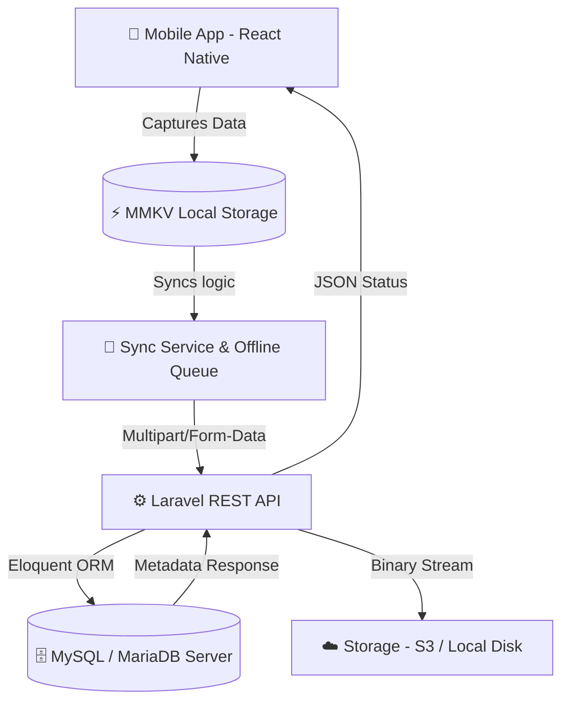

# 🌿 Pepper World Trace: Enterprise Mobile Ecosystem
> **Bridging Field-Level Precision with Cloud-Scale Intelligence.**

A professional, offline-first enterprise mobile application engineered for greenhouse agricultural observation management. This platform enables field agents to record critical data (Viruses, Pests, Irrigation, etc.) with high precision using smart QR scanning and robust Laravel-backed synchronization.

[](https://expo.dev/)
[](https://reactnative.dev/)
[](https://laravel.com/)
[](https://php.net)
[](https://pepperworld.ma)

---

## 📑 Table of Contents
1. [Project Overview](#-project-overview)
2. [Core Technologies](#-core-technologies)
3. [System Architecture](#-system-architecture)
4. [Getting Started (Beginner Friendly)](#-getting-started-beginner-friendly)
5. [QR Code & Scan Features](#-qr-code--scan-features)
6. [Cloud Infrastructure & Sync Protocol](#-cloud-infrastructure--sync-protocol)
7. [Deployment & EAS Build](#-deployment--eas-build)
8. [OTA Updates (Over-the-Air)](#-ota-updates-over-the-air)
9. [Git Workflow & Safety](#-git-workflow--safety)
10. [Enterprise Distribution & Security](#-enterprise-distribution--security)
11. [Future Roadmap](#-future-roadmap)

---

## 🚀 Project Overview
**Pepper World Trace** is designed to work in remote agricultural environments where internet connectivity is unreliable. It provides a seamless transition from manual field observations to structured, actionable data.

- **Offline-First Resilience**: All data is saved locally on the device and synchronized only when a stable internet connection is available.
- **Smart Scanning**: Instant identification of Farms, Sectors, and Greenhouses using a hybrid QR parsing engine.
- **Dynamic Inspections**: Advanced multi-block inspection forms for comprehensive greenhouse health checks with photo support.
- **Inactivity Guard**: Proactive `NotificationService` reminders if no observations are recorded within a 12-hour window.

---

## 🛠 Core Technologies

### **Frontend (Mobile)**
- **Framework**: [Expo](https://expo.dev/) (SDK 54) & [React Native](https://reactnative.dev/)
- **Routing**: Expo Router (File-based navigation)
- **State Management**: React Context API & React Query
- **Persistence**: **React Native MMKV** (High-performance native key-value storage for offline capability)
- **Scanning**: Expo Camera (QR Code/Barcode support)
- **Styling**: Native components with custom deep forest green branding
- **Notifications**: Expo Notifications

### **Backend (Cloud)**
- **Framework**: [Laravel 11](https://laravel.com/) (PHP 8.3+)
- **Database**: **MySQL / MariaDB** (Enterprise relational data storage)
- **Auth**: Laravel Sanctum (Secure token-per-device sessions)

---

## 🏗 System Architecture Diagram



---

## 👶 Getting Started (Beginner Friendly)

If you are new to the project, follow these exact steps to get set up:

### 1. Install Software
Ensure you have these installed on your computer:
- [Node.js](https://nodejs.org/) (Version 20+ Recommended)
- [Git](https://git-scm.com/)
- [VS Code](https://code.visualstudio.com/)

### 2. Download the Project
```bash
git clone <your-repository-url>
cd mobileApp_trace
```

### 3. Install Requirements
```bash
npm install
```

### 4. Run the App
- **Browser**: Run `npx expo start` and press `w`.
- **Phone (Expo Go)**: Run `npx expo start` and scan the QR code with the **Expo Go** app.

---

## 🔍 QR Code & Scan Features
The app includes a specialized "Smart Scan" feature to eliminate entry errors.

### **How to Use:**
1. Open any Observation form (Virus, Ravageurs, etc.) or the **Inspection** screen.
2. Tap the **"Scanner le QR Code de la Serre"** button at the top.
3. Grant camera permissions and align the QR code.

### **Professional JSON Format:**
The engine is optimized for JSON QR codes. When scanned, it instantly fills Farm, Secteur, and Serre details:
```json
{
  "ferme_id": "1",
  "secteur_id": "1",
  "serre_ids": ["7"]
}
```
*Note: If a simple number is scanned, the app will search the local cache to identify the Serre.*

---

## ⚙️ Cloud Infrastructure & Sync Protocol
Data is transmitted to the Laravel backend using professional Multi-Payload Batches.

### **Sync Payload Table**
| Field | Description | Laravel Validation |
| :--- | :--- | :--- |
| `observation_date` | Date of field entry | `required|date` |
| `serre_id` | Database Key of Greenhouse | `exists:serres,id` |
| `images_{n}[]` | Associated binary imagery | Multi-file array storage |
| `remarque[]` | User notes per block | `nullable|unicode` |

**Backend Logic**: The `InspectionApiController@storeInspectionApi` method handles atomic database transactions to ensure consistency for multi-block reports.

---

## 🏗 Deployment & EAS Build
We use **EAS (Expo Application Services)** to generate secure binaries.

### **Build Channels**
- **Preview**: Produces an installable APK for internal QA and Stakeholders.
- **Production**: Optimized AAB/IPA binaries for official Store distribution.

### **Commands**
```bash
# Build Testing APK
npx eas build --profile preview --platform android

# Build Production Binary
npx eas build --profile production --platform android
```

---

## 🔄 OTA Updates (Over-the-Air)
Deploy urgent fixes (text, colors, small bugs) without asking users to redownload the APK.

```bash
# Push update to Testing branch
eas update --branch preview --message "Fixed scan parsing for multi-serre IDs"

# Push update to Production
eas update --branch production --message "Optimized 12h notification logic"
```
*Important: Native changes (new plugins in `app.json`) require a full [EAS Build](#-deployment--eas-build).*

---

## 🛡 Git Workflow & Safety
To keep the enterprise project stable:
1. **Pull Latest**: Always `git pull origin main` before starting.
2. **Feature Branch**: Create a branch: `git checkout -b feature/xyz`.
3. **Commit often**: `git commit -m "Commit description"`.
4. **Test locally**: Always verify in Expo Go before merging.

---

## 🏢 Enterprise Distribution & Security
- **Runtime Locking**: Updates are locked to the specific `appVersion` policy. Changing version numbers requires a full rebuild.
- **Sanctum Auth**: Secure token-per-device lifecycle.
- **Data Cleanup**: Sensitive local caches are purged after a successful sync to maintain device privacy.

---


© 2026 Pepper World Agriculture.  
**Engineered for the future of smart agriculture.**
